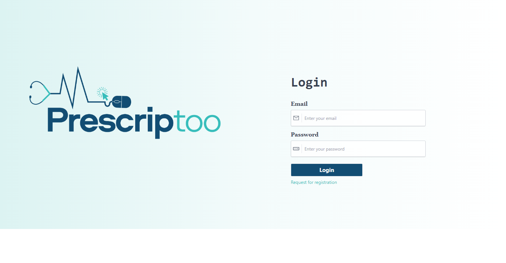
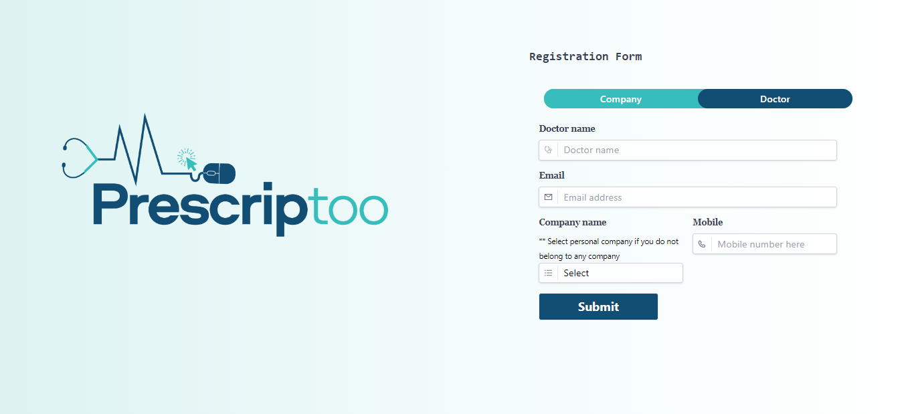
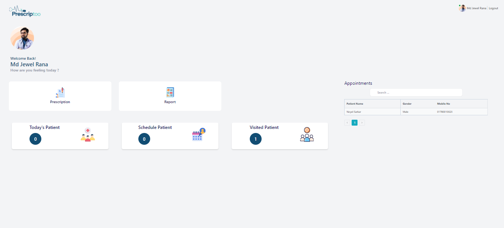
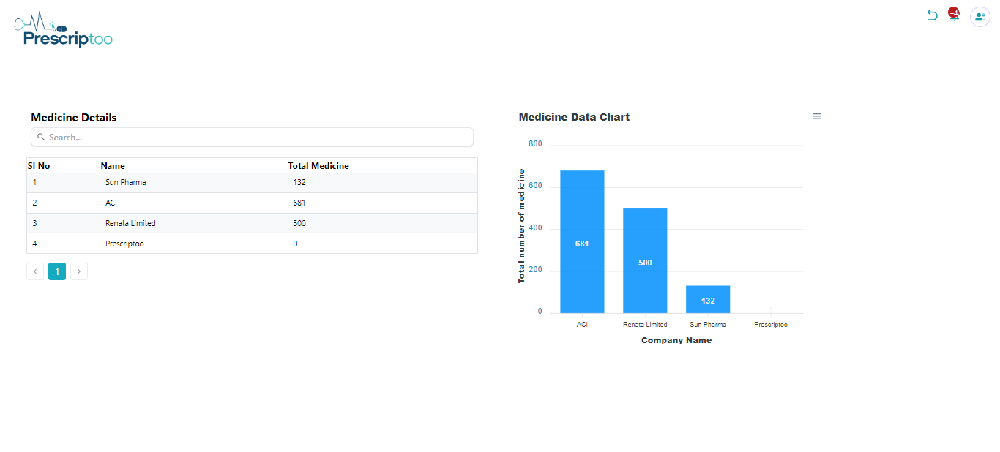

# PriscrPriscriptoo - Prescription Generator 🩺

## `Overview`

Priscriptoo is an all-in-one digital solution tailored for the healthcare industry to simplify and streamline the prescription and patient management process. With the powerful capabilities of generating PDF prescriptions and managing a multi-layer user system, the application is poised to be an indispensable tool for doctors, compounders, businesses, and administrators.

## `Features`

## `Doctors`

## Patient Management

Easily add and manage patient profiles, keeping a record of patient history at one place

## Prescription Generation

Prescribe medications and generate a downloadable PDF prescription in a few taps.

## Appointment Scheduler

Handle and reschedule patient appointments efficiently.

## Historical View

Retrieve previous prescriptions and patient interactions to provide informed care

## `Compounder`

## Patient Referrals

Add patients and refer them to doctors seamlessly.

## `Super Admin`

## Comprehensive Analytics

Gain a bird's-eye view of the system's statistics, from the number of prescriptions generated to the detailed metrics related to individual businesses, doctors, and medications.

### `Company Oversight`

Track the number of companies onboard, delve deep into how many doctors each company has, and the corresponding medications available.

## Medication Tracking

Monitor medicine consumption patterns, understand which medicine is prescribed the most, and by which doctor or company.

### `Business`

## Doctor Analytics

Understand how many doctors are registered under the company's banner

## Medication Reports

Get insights into the medications prescribed by individual doctors and view aggregate data for all company-associated prescriptions.

## `Technical Stack`

## Frontend

Developed using the powerful REACT (Javascript) libery

## Data Interchange

Utilized APIs for fetching and storing data.

## Document Generation

Integrated PDF generator (React pdf) for creating downloadable prescription and apex chart for displaying information on graph

# `Project Screenshots`

